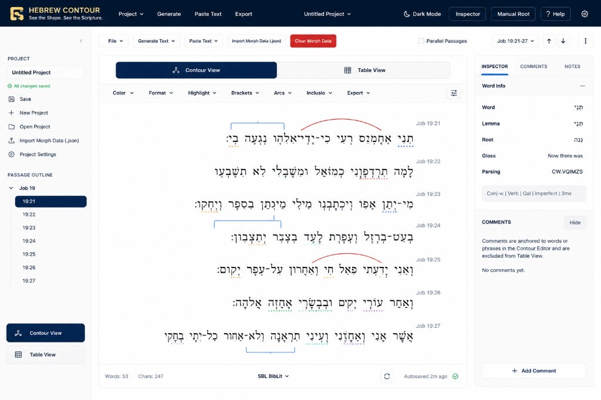

# Hebrew Contour Design System — UI Vision

This document defines the official long-term UI direction for the Hebrew Contour App. It is a **vision document**, not an instruction to rebuild the UI all at once. Future Cursor chats and contributors should reference this file instead of re-explaining the design direction.

## Visual Benchmark

The mockup below is the visual benchmark for HCDS (Hebrew Contour Design System) work:

---

## Principles

### 1. Scripture First

The Hebrew/Greek text is the primary focus of the app. The interface exists to support contouring, annotation, and table work.

### 2. Consistent Across Views

Contour View and Table View should feel like two views of the same application, not two separate apps.

Both should share:

- same top navigation style
- same toolbar style
- same panel/card treatment
- same typography
- same spacing
- same color system
- same document-first philosophy

### 3. Stable Functionality First

Never sacrifice working functionality for visual polish.

Every UI change must preserve:

- Generate Text
- Paste Text
- File menu/project handling
- Export
- Contour annotations
- Arcs
- Brackets
- Inclusio
- Comments
- Inspector
- Manual Root
- Parallel Passages
- Table View
- Autosave
- Save/load
- Dark mode

### 4. Incremental Migration

Do not attempt a full UI rewrite in one pass.

Future HCDS work should happen in small gated phases:

- visual polish only
- top navigation only
- Contour/Table toggle only
- inspector/comments only
- table view polish only
- sidebar only if useful

Each phase should be tested in Vercel Preview before continuing.

### 5. Layout Vision

The long-term UI should include:

- dark navy top application bar
- compact toolbar/ribbon beneath
- optional left passage navigation
- large central document workspace
- right inspector/comments panel
- strong Contour/Table toggle
- quiet status bar
- professional document-editor feel

### 6. Toolbar Vision

Toolbars should be compact and Word-like.

They should support the work without dominating the page.

Avoid giant stacked controls.

Avoid pushing the Scripture far down the screen.

### 7. Table View Vision

Table View should look like part of the same app.

It should not become an unrelated spreadsheet style.

It should share the same HCDS colors, spacing, buttons, and page structure.

However, preserve the old working table behavior until we intentionally redesign it.

### 8. Right Panel Vision

Inspector and Comments should be useful but secondary.

If hidden or collapsed, the workspace should reclaim the space.

### 9. Sidebar Vision

The sidebar should be navigation only.

- **Top nav** = app actions
- **Sidebar** = passage navigation
- **Main area** = Scripture/document
- **Right panel** = inspector/comments

### 10. Design Tone

The app should feel:

- professional
- quiet
- academic
- focused
- elegant
- Logos-inspired
- document-centered
- built for biblical scholarship

Avoid:

- dashboard clutter
- duplicated controls
- huge empty panels
- Bootstrap admin feel
- decorative buttons that do not work

### 12. Aleph Visual Identity (not the Clause Formatter)

Aleph Contour and the [Hebrew Clause Formatter](https://clauses.hebrewtools.org) both work with Biblical Hebrew, but they are **different products**. Aleph must develop and maintain its **own recognizable design language**—not converge toward the Clause Formatter’s look and feel.

#### Do not use as a visual reference

- Overall page layout
- Toolbar arrangement, spacing, typography, or visual hierarchy
- Color palette, button styling, or panel structure that mimics that site

The Clause Formatter may still inform **functionality** when appropriate (e.g. how scholars expect certain editing behaviors). It must **not** inform **appearance**.

#### Primary design references for Aleph

1. **This document** and the [Vision mockup](./assets/hcds-ui-vision-contour.jpeg)
2. **Aleph’s existing interface** on the stable layout (`contour-polish-v1`, HCDS tokens, dark mode)
3. Academic document editors (Word, Logos) for *interaction patterns*—not for copying another Hebrew tool’s skin

#### What Aleph should emphasize

- Document-first workspace (Scripture is the hero)
- Professional academic editing software
- Rich annotation capabilities (color, format, highlight, brackets, arcs, inclusio, export)
- Modern typography (Inter + dedicated Hebrew/Greek reading faces)
- Consistent spacing and quiet visual hierarchy
- Thoughtful true-black dark mode
- A polished experience suitable for extended scholarly contouring sessions

#### Pre-ship check for significant UI changes

Before merging meaningful UI work, ask:

> *Does this make Aleph look more like the Clause Formatter?*

If yes, choose an alternative that achieves the same functionality while reinforcing Aleph’s identity. The goal is not difference for its own sake—it is a **distinctive, recognizable interface** users associate specifically with Aleph.

### 11. Annotation Ribbon (Phase 1)

**Scope:** Phase 1 visual refinement only. Do not implement during Phase 0. No functionality should change—only the presentation and organization of annotation controls should evolve toward the Ribbon model.

#### Mindset

Stop thinking of annotation controls as large tool panels. Think of them as a **compact Ribbon** that exists to support interaction with biblical text—not replace it. The document should always remain the primary focus.

#### Current Problem

Opening annotation tools (especially Arcs) expands into a very large settings panel. The Ribbon currently occupies far too much vertical space, pushes Scripture down the page, and makes the interface feel like a settings application instead of a document editor. This violates **Scripture First**.

#### Long-Term Vision

Annotation controls should become a compact Ribbon similar to Microsoft Word, Logos Bible Software, or Adobe applications—immediately above the document, lightweight, and horizontal.

#### Ribbon Principles

The Ribbon should:

- use as little vertical space as practical
- remain mostly horizontal
- group related tools together
- eliminate large empty panels and excessive whitespace
- never dominate the workspace

Scripture should always receive the majority of the screen.

**Example:** Instead of a large expanded Arc panel, use a compact row such as:

`Arc Mode | Start | End | Color | Label | Delete | Clear`

Everything should fit in a compact ribbon—at most two rows, preferably one.

#### Progressive Disclosure

Only show controls needed for the currently selected Ribbon tool.

- Click **Arcs** → only Arc controls appear
- Click **Brackets** → only Bracket controls appear

The Ribbon should **swap** tool groups rather than stacking large sections.

#### Workspace Priority

Opening a Ribbon tool should never dramatically reduce document size. The contour workspace should continue occupying approximately **70–80%** of available visual space. The user should always be looking at Scripture—not controls.

#### HCDS Rule

The Ribbon supports the document. The Ribbon is never the document.

Every design decision should ask: *"Does this give more space back to the Scripture?"*

- If yes → probably the right direction
- If no → reconsider the Ribbon layout

---

## Next Aleph redesign pass (July 2026 notes)

The reverted Aleph shell spike (`066ef3a`) is **not** the template for the next attempt.

Before any new UI work, read **[ALEPH_UI_REDESIGN_NEXT.md](./ALEPH_UI_REDESIGN_NEXT.md)**. Key constraints for that pass:

1. **Remove** the Color / Format / Highlight / Brackets / Arcs / Inclusio / Export **annotation tab bar** — do not replace with another horizontal tab strip.
2. Integrate tools into a coherent toolbar, inspector, and contextual controls.
3. Fix Undo / B / I / U / Comments grouping and spacing.
4. Preserve all annotation functionality; document remains the focus.
5. Keep the current stable layout and dark mode until a redesign is explicitly requested.
6. **July 2026 polish pass** (`styles/contour-polish-v1.css`): spacing/typography only — no shell, no sidebars, comments column collapses by default.

---

## Warning

The previous HCDS spike tried to move too much at once and caused regressions. Future work should use this document as a visual guide while preserving the stable foundation and changing one area at a time.

---

## When in Doubt

Functionality first.

Scripture second to none.

Visual polish only after stability.

For appearance: use the Vision mockup and Aleph’s own UI—not the Hebrew Clause Formatter (see **§12 Aleph Visual Identity**).
